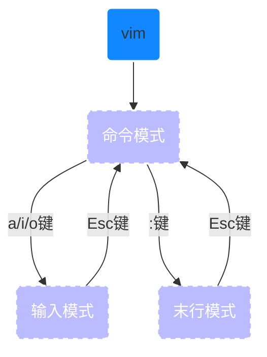
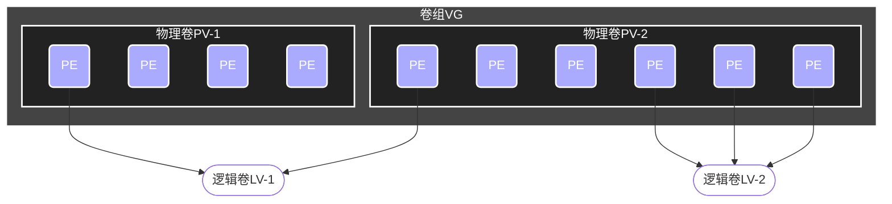
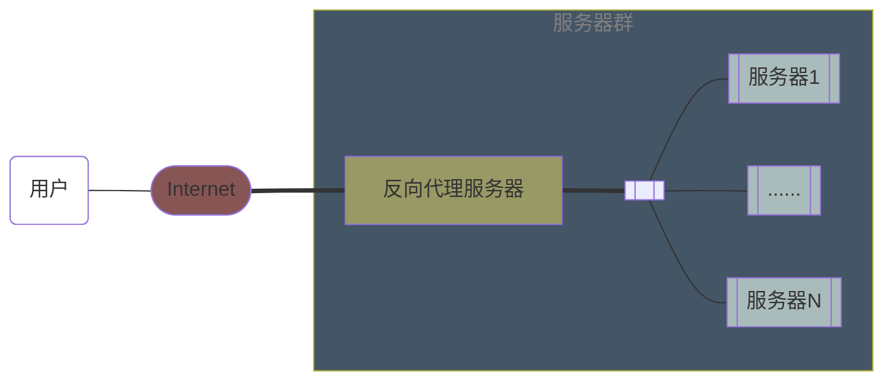

**Welcome**

[TOC]

# 一、Linux

## 1. 新手基础命令

### 1.1 针对命令的命令

<font size=6 color=red>man</font> 某个命令：查看某个命令的帮助信息

<font size=6 color=red>alias/unalias</font>：为命令创建/删除别名

- **`alias 别名='命令 [参数] [对象]'`**，比如`alias rm='rm -i'`即可将rm设置为删除前确认，但是关闭终端后失效
- **`unalias 别名`**：删除别名

<font size=6 color=red>type</font> 某个命令：查看某个命令所在目录或别名

- 如果命令不是别名，则显示其所在目录，否则显示真正的命令

<font size=6 color=red>whereis</font> 某个命令：查找命令的绝对路径

### 1.2 系统工作命令

<font size=6 color=red>echo</font>：在终端输出字符串或者变量对应的值

<font size=6 color=red>date</font>：显示和设置系统时间和日期

- `date`显示当前时间日期
- `date "+%Y-%m-%d %H:%M:%S" `以yyyy-MM-dd HH:mm:ss的格式显示日期
- `date "+%j"`显示当天是当年的第几天
- `date -s "20210101 1:30:00"`将当前时间设置为指定日期

<font size=6 color=red>reboot</font>：重启系统

<font size=6 color=red>poweroff</font>：关闭系统

<font size=6 color=red>wget</font>：下载网络文件

<font size=6 color=red>ps</font>：查看系统进程状态

| 参数   | 作用                       |
| ------ | -------------------------- |
| -a     | 显示所有进程               |
| -u     | 显示进程用户及其他详细信息 |
| -x     | 显示没有控制终端的进程     |
| (-)aux | a、u、x短格式参数合并      |

<font size=6 color=red>top</font>：动态监视进程活动和系统负载等信息，按q退出

<font size=6 color=red>pidof</font> [参数] [服务名称]：查询某个指定服务进程的PID值

<font size=6 color=red>kill</font> [参数] [进程PID]：终止某个指定PID的服务进程

<font size=6 color=red>killall</font> [参数] [服务名称]：终止指定服务的全部进程

<font size=6 color=red>Ctrl + C</font>：终止终端中正在执行的命令

<font size=6 color=red>&</font>：当命令执行时不断输出信息影响后续命令输入，可在执行命令时在末尾添加`&`使命令进入系统后台执行

<font size=6 color=red>sudo</font> passwd root：更改root用户的密码

<font size=6 color=red>su</font> 用户名：切换用户

<font size=6 color=red>systemctl</font>：管理服务的启动、重启、停止、重载、查看状态和开机启动等

- `systemctl start/restart/stop/reload/status network`开启/重启/停止/重载/查看网络服务
  - 或者用`systemctl start network.service`，加`.service`后缀
- `systemctl enable/disable/is-enabled sshd`开机自启动/不自启动/是否为开机自启动
  - 管理Linux系统原生服务（native service）自启动时可以使用`systemctl`，非原生服务则会转用`/sbin/chkconfig`命令

<font size=6 color=red>service</font>：管理服务程序

- `service mysqld start/restart/stop/reload/status`开启/重启/停止/重载/查看mysqld服务程序

<font size=6 color=red>chkconfig</font>：将服务程序加入开机启动项

- `chkconfig mysqld on`将mysqld服务程序加入开机启动项
- `chkdonfig mysqld off`将mysqld服务程序开机不启动

<font size=6 color=red>source</font>：刷新配置文件使其立即生效

### 1.3 系统状态检测命令

<font size=6 color=red>ifconfig</font> [网络设备] [参数]：获取网卡配置和网络状态等信息

- ***/etc/sysconfig/network-scripts***目录存放网卡的配置文件，网卡配置文件的名称为***ifcfg+网卡名称***，如***ifcfg-eno16777728***，可以在其中设置IP地址等参数，然后`systemctl restart network`重启网络：

  ```shell
  设备类型：TYPE=Ethernet
  地址分配模式：BOOTPROTO=static/dhcp
  网卡名称：NAME=eno16777728
  是否开机自启动：ONBOOT=yes
  IP地址：IPADDR=192.168.10.10
  子网掩码：NETMASK=255.255.255.0
  网关地址：GATEWAY=192.168.10.1
  DNS地址：DNS1=192.168.10.1
  ```
  
- Windows系统中为`ipconfig`

<font size=6 color=red>ping</font>：测试网络连通性，使用`-c`参数规定发送ICMP包的次数，`-i`参数定义数据包发送的间隔

<font size=6 color=red>nslookup</font>：检测能够从DNS服务器中查找到域名与IP地址的解析结果，检验DNS服务是否可用

<font size=6 color=red>arp</font>：查询本机ARP缓存中IP地址-->MAC地址的对应关系(`arp -a`)、添加或删除静态对应关系等。

<font size=6 color=red>uname</font>：查看系统内核和系统版本信息

- `-a`参数可完整查看系统内核名称、主机名、内核发行版本、节点名、系统时间、硬件名称、硬件平台、处理器类型和操作系统名称信息

- `cat /etc/redhat-release`查看当前系统版本的详细信息

<font size=6 color=red>uptime</font>：查看系统负载信息，包括当前系统时间、系统已运行时间、启用终端数、平均负载值（系统在最近1、5、15 min的负载情况，越低越好）

<font size=6 color=red>free</font>：显示当前系统内存使用量，`-m`参数显示单位为MB，`-h`参数显示单位为GB

<font size=6 color=red>who</font>：显示当前登录本机的用户及其开启的终端信息

<font size=6 color=red>last</font>：查看所有系统的登录记录

<font size=6 color=red>history</font>：显示历史执行命令，列出的命令前有编码数字，可以通过`!编码数字`来执行数字对应的命令。显示的条数可以通过修改/etc/profile中的`HISTSIZE`值来自定义。历史命令保存到~/.bash_history文件中，可使用`history -c`来清除记录

<font size=6 color=red>sosreport</font>：收集系统运行状态和配置信息并输出诊断文档

### 1.4 工作目录切换命令

<font size=6 color=red>pwd</font>：显示当前所处的工作目录

<font size=6 color=red>cd</font>：切换工作路径

- `cd /etc`切换到/etc目录
- `cd -`切换到上一次所在目录
- `cd ..`切换到上级目录
- `cd ~`切换到home目录
- `cd ~username`切换到username的home目录

<font size=6 color=red>ls</font> [选项] [文件]：查看目录中的文件信息

| 参数 | 作用                                                         |
| ---- | ------------------------------------------------------------ |
| -a   | 查看全部文件，包括隐藏文件                                   |
| -l   | 查看文件的属性、大小等详细信息，加`-h`可以用MB/GB单位显示大小 |
| -al  | 组合`-a`和`-l`参数                                           |
| -ld  | 查看目录的属性信息而不是目录中的文件的属性信息               |

### 1.5 文本文件编辑命令

<font size=6 color=red>cat</font>：查看内容较少的纯文本文件的内容，`-n`参数显示行号

<font size=6 color=red>more</font>：查看内容较多的纯文本文件，空格向下翻页，回车键下一行，按`q`退出

<font size=6 color=red>head</font> -n [N] [文件]：查看纯文本文档的前N行

<font size=6 color=red>tail</font> -n [N] [文件]：查看纯文本文件的后N行

- `tail -f [文件]`持续刷新文件内容，每次刷新都再次获得文件的全部内容，可用于实时查看最新日志文件

<font size=6 color=red>tr</font> [原始字符] [目标字符]：替换字符，复制标准输入并替换或删除字符后转为标准输出

<font size=6 color=red>wc</font> [参数] 文本：统计指定文本的行数、字数、字节数

| 参数 | 作用         |
| ---- | ------------ |
| -l   | 只显示行数   |
| -w   | 只显示单词数 |
| -c   | 只显示字节数 |

<font size=6 color=red>stat</font>：查看文件的存储信息和时间状态

| 输出信息 | 意思                        |
| -------- | --------------------------- |
| Access   | 文件访问时间atime           |
| Modify   | 文件内容修改时间mtime       |
| Change   | 文件权限或属性更改时间ctime |

<font size=6 color=red>cut</font> [参数] 文本：按“列”提取文本字符

| 参数 | 作用           |
| ---- | -------------- |
| -d   | 指定分隔符     |
| -f   | 指定提取哪一列 |

- `cut -d: -f1 /etc/passwd`以`:`为分隔符，查看第一列
- `cut -d : -f 2 /etc/passwd` `-d`和`-f`和后面的参数之间可以有空格

<font size=6 color=red>diff</font> [参数] 文本1 文本2：比较两个文本文件的差异

- `diff --brief 文本1 文本2`确认两个文件是否**不同**，如果内容相同则什么也不输出
- `diff -c 文本1 文本2`详细比较两个文件的差异

### 1.6 文件目录管理命令

<font size=6 color=red>touch</font> [参数] 文件：创建空白文件，或者设置文件的访问、内容修改、属性更改时间

- `touch 文件名`创建空白文件
- `touch -a 文件`仅修改*读取时间*atime
- `touch -m 文件`仅修改*修改时间*mtime
- `touch -d 文件`同时修改atime和mtime

<font size=6 color=red>mkdir</font>：创建空白目录，使用-p参数创建嵌套结构的目录

- `mkdir dir1`
- `mkdir -p dir1/dir2/dir3`
- `mkdir -p /home/linuxprobe/dir1/dir2`

<font size=6 color=red>cp</font> [选项] 源文件 目标文件：复制文件或目录

- 当源文件不是目录时
  - 若目标文件是目录，则会把源文件复制到目录中
  - 若目标文件为普通文件，则会用源文件的内容覆盖目标文件
  - 若目标文件不存在，则创建一个目标文件后复制

| 参数 | 作用                                                         |
| ---- | ------------------------------------------------------------ |
| -p   | 不仅复制内容，还复制原始文件的属性如修改时间、访问权限等     |
| -d   | 若对象为链接文件，还保留链接文件的属性                       |
| -r   | 当源文件为目录时必须使用，递归持续复制，目标文件也必须为目录 |
| -i   | 若目标文件存在，则询问是否覆盖                               |
| -f   | 直接覆盖已存在的文件不询问                                   |
| -a   | 相当于-pdr，通常在拷贝目录时使用，可保留链接和文件属性       |

<font size=6 color=red>mv</font> [参数] 源文件 [目标路径 | 目标文件名]：剪切或重命名文件，在同一个目录中对文件进行剪切就可以重命名

<font size=6 color=red>rm</font>：删除文件或目录，非root用户不会询问

| 参数 | 作用             |
| ---- | ---------------- |
| -i   | 删除前确认       |
| -r   | 删除目录必须添加 |
| -f   | 强制删除不确认   |

<font size=6 color=red>dd</font> [参数]：按照指定大小和个数的数据块来复制或转换文件。Linux系统中有个*/dev/zero*文件，不占用系统存储空间，却可以提供无穷无尽的数据，可以使用它作为`dd`命令的输入文件来生成一个指定大小的文件

| 参数  | 作用                 |
| ----- | -------------------- |
| if    | 输入的文件名称       |
| of    | 输出的文件名称       |
| bs    | 设置每个块的大小     |
| count | 设置要复制的块的个数 |

- `dd if=/dev/zero of=file1 count=1 bs=560m`从/dev/zero文件中复制总共1\*560 M的数据到文件*file1*中

<font size=6 color=red>file</font> 文件：查看文件类型

### 1.7 打包压缩与搜索命令

<font size=6 color=red>tar</font> [参数] [文件]：压缩或解压，压缩文件格式主要有.tar/.tar.gz/.tar.bz2

| 参数 | 作用                                           |
| ---- | ---------------------------------------------- |
| -c   | 压缩文件，需指定压缩包名称和后缀               |
| -x   | 解压文件，与-c不能同时使用                     |
| -t   | 查看压缩包内有哪些文件                         |
| -z   | 用Gzip压缩或解压                               |
| -j   | 用bzip2压缩或加压                              |
| -v   | 显示压缩或解压的过程                           |
| -f   | 压缩或解压的目标文件名，必须放在参数的最后一位 |
| -p   | 保留原始的权限和属性                           |
| -P   | 使用路径来压缩                                 |
| -C   | 指定解压到的目录                               |

- `tar -czvf 压缩包名称.tar.gz 要打包的文件/目录`打包指定的文件并命名
- `tar -xzvf 压缩包名称.tar.gz -C 解压的路径`将指定压缩包解压到指定路径

<font size=6 color=red>unzip</font>：解压/压缩zip格式的压缩包

<font size=6 color=red>grep</font> [参数] 关键词 文件：在多个文本中执行关键词搜索，并显示具有关键词的==行==

| 参数 | 作用                         |
| ---- | ---------------------------- |
| -b   | 将可执行文件当做文本文件搜索 |
| -c   | 仅显示找到的行数             |
| -i   | 忽略大小写                   |
| -n   | 显示行号                     |
| -v   | 反选——列出没有关键词的行     |

- `grep -n Hello file1` 查找*file1*中包含Hello的行
- `grep -n "Hello world" file1`查找*file1*中包含"Hello world"的行
- `grep -vn "Hello world" file1 file2`查找*file1*和*file2*中不包含"Hello world"的行
- `grep -v "^$" file1`过滤***file1***中的空白行，`^$`表示空白行

<font size=6 color=red>find</font> 查找路径 [参数] [下一步操作]：按照指定条件查找==文件==

| 参数                       | 作用                                                         |
| -------------------------- | ------------------------------------------------------------ |
| -name                      | 匹配名称                                                     |
| -perm                      | 匹配权限，mode为完全匹配，-mode为包含即可                    |
| -user                      | 匹配所有者                                                   |
| -group                     | 匹配所有组                                                   |
| -mtime -n +n               | 匹配修改内容的时间，-n指n天以内，+n指n天以前                 |
| -atime -n +n               | 匹配文件访问时间                                             |
| -ctime -n +n               | 匹配修改文件权限和属性的时间                                 |
| -nouser                    | 匹配无所有者的文件                                           |
| -nogroup                   | 匹配无所有组的文件                                           |
| -newer f1 !f2              | 匹配比文件*<u>f1</u>*新但比文件*<u>f2</u>*旧的文件           |
| --type b/d/c/p/l/f         | 匹配文件类型，块设备/目录/字符设备/管道/链接文件/文本文件    |
| -size +50KB/-50KB          | 匹配文件的大小，查找超过50KB/小于50KB的文件                  |
| -prune                     | 忽略某个目录                                                 |
| -exec 下一步操作命令 {} \; | 将`find`命令搜索到的结果交给`-exec`后面紧跟的命令处理，`{}`表示`find`命令查找到的文件，==且必须以==`\;`==结尾== |

- `find /etc -name "host*"`查找*/etc*目录中所有名字以`host`开头的文件
- `find / -perm -4000 -print`在整个系统中搜索权限中包含SUID权限的所有文件，使用`-4000`即可
- `find / -user linuxprobe -exec cp -a {} /home/linuxprobe/findresults/ \;`在整个文件系统中查找用户为linuxprobe的文件并复制到*/home/linuxprobe/findresults/*目录中。

### 1.8 网络相关命令

<font size=6 color=red>curl</font>：


## 2. 管道符、重定向和环境变量

### 2.1 输入输出重定向

- 标准输入（STDIN，文件描述符为0）：默认从键盘输入，也可以从其他命令或文件中输入
- 标准输出（STDOUT，文件描述符为1，可以省略）：默认输出到屏幕
- 错误输出（STDERR，文件描述符为2，==不能省略==）：默认输出到屏幕

<font size=5>**输入重定向**</font>：把文件导入到命令中

1. **`命令 < 文件`**将文件作为命令的标准输入
   - `wc -l < readme.txt`等同`wc -l readme.txt`等同于`cat readme.txt | wc -l`

2. **`命令 << 分界符`**从标准输入中读入，直到遇到分界符才停止

3. **`命令 < file1 > file2`**将***file1***作为命令的标准输入并将命令的标准输出重定向到***file2***中

<font size=5>**输出重定向**</font>：把原本要输出到屏幕的数据写入到指定文件中

- 标准输出重定向
  - 清空写入（覆盖原文件的内容）
  - 追加写入（添加到原文件的后面
- 错误输出重定向
  - 清空写入
  - 追加写入

1. **`命令 > 文件`**将**标准输出**重定向到文件中（覆盖原文件的内容）
   - `man bash > readme.txt`
1. **`命令 2> 文件`**将**错误输出**重定向到文件中（覆盖原文件的内容）
   - `ls -l linuxprobe > file1.txt`若*linuxprobe*存在，输出重定向到*file1.txt*中
   - `ls -l linuxprobe 2> file1.txt`若linuxprobe存在，依然输出到*屏幕*上
1. **`命令 >> 文件`**将**标准输出**重定向到文件中（追加到原文件的内容后面）
   - `echo "Welcome to Linux" >> readme.txt`
1. **`命令 2>> 文件`**将**错误输出**重定向到文件中（追加到原文件的内容后面）
1. **`命令 >> 文件 2>%1`** 或者**`命令 &>> 文件`**将**标准输出**和**错误输出**共同写入文件（追加到原文件的后面）

- */dev/null*：Linux的黑洞文件，可以把输出信息重定向到这个文件中，等同于删除输出信息，可使窗口保持简洁

### 2.2 管道命令符

- `grep -c "/sbin/nologin" /etc/passwd`等同于`grep "/sbin/nologin" /etc/passwd | wc -l`，在用户信息*/etc/passwd*中查找终端为`nologin`的用户，该用户不允许登录，仅显示用户数

- `man ls | more`将`ls`命令的帮助信息传给`more`命令，用翻页形式查看

- `echo "Content Hello World" | mail -s "Subject Linux is Funny" linuxprobe`

  等同于

  ```shell
  mail -s "Subject Linux is Funny" linuxprobe@linuxprobe.com << over(分界符)
  > Content Hello World
  > over(分界符)
  ```

  将主题为"Subject Linux is Funny"内容为"Content Hello World"的邮件发送给linuxprobe@linuxprobe.com主机上的linuxprobe用户

### 2.3 命令行的通配符

| 通配符 | 作用               |
| ------ | ------------------ |
| *      | 匹配零个或多个字符 |
| ?      | 匹配单个字符       |
| [0-9]  | 匹配0~9            |
| [123]  | 匹配1或2或3        |

### 2.4 常用的转义字符

| 转义字符     | 作用                               |
| ------------ | ---------------------------------- |
| 反斜杠`\`    | 使反斜杠后面的变量变为单纯的字符串 |
| 单引号`''`   | 转义其中的所有变量为单纯的字符串   |
| 双引号`""`   | 保留其中的变量属性，不进行转义     |
| 反引号` `` ` | 执行其中的命令后返回结果，等同于`$(命令)`或`$"命令"` |

```shell
PRICE=5 // 定义一个变量
echo "Price is $PRICE" // 输出Price is 5
echo 'Price is $PRICE' // 输出Price is $PRICE
echo "Price is $$PRICE" // 输出PRICE is 2639PRICE，$$表示当前程序的进程ID
echo "Price is \$$PRICE" // 输出Pirce is $5
echo `uname -a` // 等同于uname -a，查看本机的用户、系统版本和内核信息
```

### 2.5 重要的环境变量

| 环境变量     | 作用                      | 环境变量 | 作用 |
| ------------ | ------------------------- | ------------------------- | ------------------------- |
| HOME         | 用户的主目录              |LANG|系统语言、语系名称|
| SHELL        | 用户使用的Shell解释器名称 |RANDOM|生成一个随机数字|
| HISTSIZE     | 输出的历史命令记录条数    |PS1|Bash解释器的提示符|
| HISTFILESIZE | 保存的历史命令记录条数    |PATH|定义解释器搜索用户执行命令的路径|
| MAIL         | 邮件保存路径              |EDITOR|用户默认的文本编辑器|

- <font size=6 color=red>export</font>：将某个用户定义的局部变量提升为全局变量，其他用户也可访问使用。终端关闭即失效

- 要将服务程序自带的命令变成终端可执行的命令，就需要将命令所在目录加入到终端的PATH变量中。可以在***/etc/profile***文件中加入命令目录，即可将命令永久性定义到PATH变量中，在主机重启后即可永久生效。要想不重启设备而让命令立即生效，则可使用<font size=6 color=red>source</font>命令加载***/etc/profile***文件使PATH变量立即生效

  ```shell
  [root ~]# vim /etc/profile
  ...
  // export将新定义的PATH变量升为全局变量，$PATH为原PATH变量，追加的不同命令目录之间用:隔开
  export PATH=$PATH:/usr/local/mysql/bin:/usr/local/openssl/bin
  unset i
  unset -f pathmunge
  [root ~]# source /etc/profile
  ```

  


## 3. Vim编辑器与Shell命令脚本

### 3.1 Vim编辑器的三种模式



- **命令模式**：控制光标移动，可对文本进行复制、粘贴、删除和查找等
  - `dd`删除（剪切）光标所在整行
  - `5dd`删除（剪切）从光标处开始的5行
  - `yy`复制光标所在整行
  - `5yy`复制从光标处开始的5行
  - `n`显示搜索命令定位到的下一个字符串
  - `N`显示搜索命令定位到的上一个字符串
  - `u`撤销上一个操作
  - `p`将之前删除(dd)或复制(yy)的数据粘贴到光标后面
- **输入模式**：正常的文本录入，从命令模式到输入模式可以按`a、i、o`
  - `a`在光标后面一位切换到输入模式
  - `i`在光标当前位置切换到输入模式
  - `o`在光标下一行创建一个空行
- **末行模式**：保存或退出文档，以及设置编辑环境

| 命令 | 作用 | 命令 | 作用 |
| ----- | ------------ | --------- | -------------------- |
| :w    | 保存         | :set nu   | 显示行号                     |
| :q | 退出 | :set nonu | 不显示行号                   |
| :wq   | 保存并退出   | :命令     | 执行该命令                   |
| :q! | 强制退出，不保存更改 | :整数     | 跳转到改行                   |
| :wq!  | 强制保存退出 | ?字符串   | 在全文中从下至上搜索该字符串 |
| :s/one/two | 将当前光标所在行的第一个one替换成two |/字符串|在全文中从上至下搜索该字符串|
| :s/one/two/g | 将当前光标所在行的所有one替换成two |           |                              |
| :%s/one/two/g | 将全文中的所有one替换成two |           |                              |

### 3.2 Shell脚本

#### 3.2.1 脚本声明和注释

- `#!/bin/bash`告诉系统使用哪种Shell解释器来执行该脚本
- `#`注释信息

#### 3.2.2 脚本执行

- `bash example.sh`用bash解释器直接运行Shell脚本
- `./example.sh`输入完整路径来执行，但是会因为权限不足而不能运行
  - 解决方法：`chmod u+x exmple.sh`为脚本增加执行权限后输入完整路径即可执行

#### 3.2.3 接受用户参数

- `$0`当前Shell脚本程序的名称

- `$#`总共有几个参数

- `$?`上一次命令执行的返回值

- `$1, $2, $3..., $N`分别对应第N个位置的参数值

  ```shell
  [root@linuxprobe ~]# ./Example.sh one two three four five six
  ```

- `read`在**Shell脚本中**用来读取用户输入信息，并把接受到的用户输入赋值给后面的变量
  
  - `read -p "Enter you score(0-100): " GRADE`可把用户输入的值赋给`GRADE`

#### 3.2.4 条件测试语句

​	Shell脚本中的条件测试/判断句语句格式为`[ 条件表达式 ]`，==左右方括号与表达式之间必须有空格==，条件成立返回`0`，否则返回其他随机数字。

- **文件测试语句**

  - `[ -d /etc/fstab ]`，随后可以用`echo $?`查看上一条命令执行的返回值

  | 参数 | 作用               | 参数 | 作用                       |
  | ---- | ------------------ | ---- | -------------------------- |
  | -d   | 测试文件是否为目录 | -r   | 测试当前用户是否有权限读取 |
  | -e   | 测试文件是否存在   | -w   | 测试当前用户是否有权限写入 |
  | -f   | 测试是否为一般文件 | -x   | 测试当前用户是否有权限执行 |

- **逻辑测试语句**——对测试结果进行逻辑分析

  - `$$`前面的命令(不管是条件测试语句还是Shell命令)执行成功后才会执行后面的命令
    - `[ -e /dev/cdrom ] && echo "Exist"`判断文件是否存在，若存在则输出`Exist`
  - `||`前面的命令执行失败后才会执行后面的命令
    - `[ $USER=root ] || echo "not root"`
  - `！`条件测试结果取反
    - `[ !$USER=root ] && echo "user" || echo "root"`

- **整数比较语句**

  - `[ 10 -eq 10 ]`然后`echo $?`输出`0`

  | 参数 | 作用   | 参数 | 作用     |
  | ---- | ------ | ---- | -------- |
  | -eq  | 等于   | -lt  | 小于     |
  | -ne  | 不等于 | -le  | 小于等于 |
  | -gt  | 大于   | -ge  | 大于等于 |

- **字符串比较语句**
  
  - `=`比较字符串内容是否相同
  - `!=`比较字符串内容是否**不相同**
  - `-z`判断字符串内容是否为空，可以判断变量是否为空，进而判断是否定义了该变量

#### 3.2.5 流程控制语句

- **if条件语句**

  - `then`需要放到`if/elif`的下一行，放在同一行时需在`then`之前加分号`;`

  ```shell
  # 第一种形式
  if 条件测试语句
  	then 命令序列
  fi
  # 第二种形式
  if 条件测试语句
  	then 命令序列1
  else
  	命令序列2
  fi
  # 第三种形式
  if 条件测试语句1; then
  	命令序列1
  elif 条件测试语句2; then
  	命令序列2
  else
  	命令序列3
  fi
  ```

- **for循环语句**

  ```shell
  for 变量名 in 取值列表
  do
  	命令序列
  done
  ```

- **while循环语句**

  ```shell
  while 条件测试语句
  do
  	命令序列
  done
  ```

- **case条件语句**

  ```shell
  case 变量值 in
  模式1)
  	命令序列1
  	;;
  模式2)
  	命令序列2
  	;;
  ......
  *)
  	默认命令序列
  esac
  ```

#### 3.2.6 计划任务服务程序

<font size=6 color=red>at</font>：一次性计划任务

- `at 时间`开始输入一次性计划任务，按`Ctrl + D`结束编写，交互式

  ```shell
  [root@linuxprobe ~]$ at 20:45
  at> systemctrl restart httpd
  at> <EOT> (按Ctrl+D之后结束编写任务)
  ```

  等同于

  `echo "systemctrl restart httpd" | at 20:45`

  利用管道符让`at`接受`echo`的输出信息，取代交互式

- `at -l`查看已设置但未执行的一次性任务

- `atrm 任务序号`删除一次性任务

<font size=6 color=red>crontab</font>：crond服务，设置周期性的计划任务

- `crontab -e`创建、编辑计划任务，一个任务放一行，任务格式为：*分 时 日 月 星期 命令*，没有的字段设为`*`，*分*字段必须有数值，*日*和*星期*不能同时使用。可以用逗号`,`分隔多个时间段（如`8,9,10`表示8，9，10月），用横杠`-`表示连续的时间（如`12-15`表示12-15日），用斜杠`/`表示执行任务的时间间隔（如`/2`表示间隔2分钟执行一次任务）。命令必须用绝对路径（可用<font size=6 color=red>whereis</font>查询）
- `crontab -l`查看当前计划任务，每一行表示一个计划任务
- `crontab -r`删除全部计划任务


## 4. 用户身份与文件权限

### 4.1 用户身份与能力

<font size=6 color=red>useradd</font> [参数] 用户名：创建新用户

| 参数 | 作用     | 参数 |     作用     |
| ---- | ------------------------------------------ | ------------------------------------------ | ------------------------------------------ |
| -d   | 指定用户的home目录，默认为*/home/username* | -g   | 指定一个初始的用户基本组(必须已存在)，对应gid |
| -e   | 账户的到期时间，格式为YYYY-MM-DD           | -G   | 指定一个或多个扩展用户组，对应groups   |
| -u   | 指定该用户的默认UID                        | -N   | 不创建与用户同名的基本用户组       |
| -s   | 指定该用户的默认Shell解释器                |      ||

```shell
[root@linuxprobe ~]# useradd -d /home/linux -u 8888 -s /sbin/nologin linuxprobe-1
[root@linuxprobe ~]# id linuxprobe-1
uid=8888(linuxprobe-1) gid=8888(linuxprobe-1) groups=8888(linuxprobe-1)
```

<font size=6 color=red>groupadd</font> [参数] 群组名：创建用户组

<font size=6 color=red>usermod</font> [参数] 用户名：修改用户属性

| 参数  | 作用                                                         | 参数 | 作用                 |
| ----- | ------------------------------------------------------------ | ---- | -------------------- |
| -c    | 填写用户账户的备注信息                                       | -g   | 变更所属用户组gid    |
| -d -m | 两个参数连用，可重新指定用户的home目录并自动把旧数据转移过去 | -G   | 变更扩展用户组groups |
| -e    | 账户的到期时间，格式为YYYY-MM-DD                             | -s   | 变更默认终端         |
| -L    | 锁定用户，禁止其登录系统                                     | -u   | 修改用户的UID        |
| -U    | 解锁用户，允许其登录系统                                     |      |                      |

```shell
// 上面用useradd创建了linuxprobe-1用户，自动创建了同名基本用户组
[root@linuxprobe ~]# id linuxprobe-1
uid=8888(linuxprobe-1) gid=8888(linuxprobe-1) groups=8888(linuxprobe-1)
// 用groupadd创建一个新的用户组
[root@linuxprobe ~]# groupadd linuxprobe-2
// 用usermod将linuxprobe-1的用户组改为linuxprobe-2
[root@linuxprobe ~]# usermod -g linuxprobe-2 linuxprobe-1
[root@linuxprobe ~]# id linuxprobe-1
uid=8888(linuxprobe-1) gid=8889(linuxprobe-2) groups=8889(linuxprobe-2)
// 将linuxprobe-1加到root用户组，扩展组列表会出现root用户组
[root@linuxprobe ~]# usermod -G root linuxprobe-1
[root@linuxprobe ~]# id linuxprobe-1
uid=8888(linuxprobe-1) gid=8889(linuxprobe-2) groups=8889(linuxprobe-2),0(root)
// 此时将linuxprobe-1的用户组改为linuxprobe-1，linuxprobe-1这个基本用户组并没有失效
[root@linuxprobe ~]# usermod -g linuxprobe-1 linuxprobe-1
[root@linuxprobe ~]# id linuxprobe-1
uid=8888(linuxprobe-1) gid=8888(linuxprobe-1) groups=8888(linuxprobe-1),0(root)
```

<font size=6 color=red>passwd</font> [参数] [用户名]：修改用户密码、过期时间和认证信息等

| 参数    | 作用                                                         |
| ------- | ------------------------------------------------------------ |
| -l      | 锁定用户，禁止其登录                                         |
| -u      | 解除锁定，允许用户登录                                       |
| -d      | 使该用户可用空密码登录系统                                   |
| -e      | 强制用户在下次登录时修改密码                                 |
| -S      | 显示用户的密码是否被锁定，以及密码所采用的的加密算法名称     |
| --stdin | 允许通过标准输入修改用户密码，如`echo "NewPassWord" | passwd --stdin Username` |

<font size=6 color=red>userdel</font> [参数] 用户名：删除用户，home目录默认保留

| 参数 | 作用         | 参数 | 作用                   |
| ---- | ------------ | ---- | ---------------------- |
| -f   | 强制删除用户 | -r   | 同时删除用户及home目录 |

### 4.2 文件权限与归属

- **文件类型**

  | 符号         | 文件类型     | 符号 | 文件类型   |
  | ------------ | ------------ | ---- | ---------- |
  | -            | 普通文件     | d    | 目录文件   |
  | l（link的l） | 链接文件     | b    | 块设备文件 |
  | c            | 字符设备文件 | p    | 管道文件   |

- **目录**文件的权限

  - 可读（字符表示`r`，数字表示`4`）：读取目录内的文件列表
  - 可写（字符表示`w`，数字表示`2`）：在目录内新增、删除、重命名文件
  - 可执行（字符表示`x`，数字表示`1`）：能够进入目录

- **权限表示**

  - 每个主体（文件所有者、文件所属组、其他用户）对文件的权限始终用三个字符来表示读、写、执行权限，简写为`rwx`，其中没有的权限置为`-`
  - 每个文件的权限都包括***文件所有者***、***文件所属组***、***其他用户***对其的权限
    - `rwx-wx-w-`表示__*文件所有者*__有读、写、执行权限`rwx`，__*文件所属组*__有写权限`-w-`，__*其他用户*__有写、执行权限`-wx`，数字表示法为`723`

- 示例

  ```shell
  [root@linuxprobe ~]# ls -l file1.txt
  -rw-r--r--. 1 root root 12 Dec 28 20:35 file1.txt
  // 最开始的-代表文件类型为普通文件，rw-、r--、r--分别为文件所有者、所有组、其他用户的权限
  // 第一个root表示文件所有者，第二个root表示文件所有组
  // 剩下的表示文件大小、修改时间、名称
  
  [root@linuxprobe ~]# ls -ld dir1
  drwxr-xr-x. 2 root root 18 Dec 28 20:35 dir1
  // 开头的d表示文件类型为目录
  ```

### 4.3 文件的特殊权限

- <font size=5>**SUID**</font>：对==**二进制程序**==进行设置的特殊权限，可以让二进制程序的执行者临时拥有程序文件==**所有者**==的权限（<u>仅对拥有执行权限的二进制程序有效</u>）

  1. `passwd`命令和***/etc/shadow***文件的所有者皆为root

  2. 所有人都可以执行`passwd`命令修改自己的用户密码，将密码写入***/etc/shadow***中

  3. 但是***/etc/shadow***文件的权限表明除了管理员之外其他所有用户都没有查看或编辑该文件的权限，那么普通用户是怎么通过`passwd`命令来修改密码从而间接访问***/etc/shadow***文件的？

     ```shell
     [root@linuxprobe ~]# ls -l /etc/shadow
     ----------. 1 root root 1155 Dec 28 20:45 /etc/shadow
     // 虽然root作为/etc/shadow的所有者没有rwx权限，但是root同时作为管理员（UID为0）是对/etc/shadow有rwx权限的
     ```

  4. 因为`passwd`命令（或者说***/bin/passwd***文件，Linux中一切皆文件）加上了SUID特殊权限位，可以使得普通用户在执行该命令时获得程序所有者root的身份，把变更的密码信息写入***/etc/shadow***文件中

     ```shell
     [root@linuxprobe ~]# ls -l /bin/passwd
     -rwsr-xr-x. 1 root root 27832 Jan 30 2014 /bin/passwd
     ```
     
     文件==**所有者**==的权限`rwx`变为了`rws`，`x`变成了`s`就意味着该文件被赋予了SUID权限，同时其他所有用户都具有`x`权限

- <font size=5>**SGID**</font>

  - 让执行者临时拥有==**所属组**==的权限（对拥有执行权限的==**二进制程序**==进行设置）

    - 赋予了SGID特殊权限的文件，通过`ls -l`查看其属性信息时，访问权限中==**所属组**==的权限的`x`变为`s`

  - 在某个目录中创建的文件自动继承该目录的用户组（只可以对**==目录==**进行设置）

    - 一个用户创建或传送一个文件后，该文件的所有者即为该用户，所有组即为该用户的基本用户组

      ```shell
      [root@linuxprobe ~]# cd /tmp
      [root@linuxprobe tmp]# mkdir testdir
      [root@linuxprobe tmp]# ls -ald testdir
      drwxr-xr-x. 2 root root 6 Dec 29 16:25 testdir
      // testdir目录的所属组即为root用户的基本用户组
      ```

    - 使用`chmod`命令为***/tmp/testdir***设置`777`权限并设置SGID特殊权限后，切换到普通用户，在该目录中创建文件，新创建的文件会自动继承其所在目录的所属组

      ```shell
      [root@linuxprobe tmp]# chmod -Rf 777 testdir
      // g+s表示设置SGID特殊权限位
      [root@linuxprobe tmp]# chmod -Rf g+s testdir
      [root@linuxprobe tmp]# ls -ald testdir
      drwxrwsrwx. 2 root root 6 Dec 29 16:25 testdir
      // testdir目录的所属组的权限有rwx变为rws
      su - linuxprobe
      [linuxprobe@linuxprobe tmp]$ cd /tmp/testdir
      [linuxprobe@linuxprobe testdir]$ echo "Hello world" > test
      [linuxprobe@linuxprobe testdir]$ ls -al test
      -rw-rw-r--. 1 linuxprobe root 15 Dec 29 16:28 test
      // 由linuxprobe用户创建的文件的所属组继承了其所在目录的所属组
      ```

- <font size=5>**SBIT**</font>：Stickey Bit（粘滞位），设置了SBIT特殊权限的==**目录**==，其内的文件只能被其所有者删除

  - 当目录被设置 SBIT 特殊权限位后，文件的==**其他用户**==权限部分的`x`执行权限就会被替换成`t`或者`T`，原本有`x`执行权限则会写成`t`，原本没有`x`执行权限则会被写成`T`

    ```shell
    [linuxprobe@linuxprobe tmp]$ ls -ald
    drwxrwxrwt. 17 root root 4096 Dec 29 17:17 .
    [linuxprobe@linuxprobe tmp]$ echo "Hello world" > test
    [linuxprobe@linuxprobe tmp]$ ls -l test
    -rw-rw-r--. 1 linuxprobe linuxprobe 12 Dec 29 17:17 test
    [linuxprobe@linuxprobe tmp]$ chmod 777 test
    [linuxprobe@linuxprobe tmp]$ ls -al test
    -rwxrwxrwx. 1 linuxprobe linuxprobe 12 Dec 29 17:17 test
    ```

    其他普通用户对***/tmp***目录的权限包含了可写`w`，看起来其他用户似乎对***/tmp***目录内的文件具有删除权限（[目录文件的权限](#4.2 文件权限与归属)），并且其内的***test***文件的权限被设为`777`，看起来其他普通用户可以随意rwx。但是文件能否被删除并不取决于自身的权限，而是看其所在目录是否有写入权限。由于***/tmp***设置了SBIT特殊权限位，非***test***文件的所有者不能删除该文件。

    ```shell
    // 切换到其他普通用户
    [linuxprobe@linuxprobe tmp]$ su linuxprobe-1
    [linuxprobe-1@linuxprobe tmp]$ rm -f test
    rm: cannot remove ‘test’: Operation not permitted
    ```

  - 设置SBIT粘滞位：`chmod`命令，`o+t`参数

    ```shell
    [root@linuxprobe tmp]# mkdir linux
    [root@linuxprobe tmp]# chmod -R o+t linux
    drwxr-xr-t. 2 root root 6 Dec 30 14:47 linux
    ```

<font size=6 color=red>chmod</font> [参数] 权限 文件或目录名称：设置文件或目录的权限，权限用**数字表示法**来同时设置***所有者/所属组/其他用户***的权限，或者用`u/g/o+r/w/x/s/t`来单独设置***所有者/所属组/其他用户***的***读/写/执行/SUID or SGID/SBIT***权限

<font size=6 color=red>chown</font> [参数] 所有者:所属组 文件或目录名称：设置文件或目录的所有者和所属组

**· **`chmod`和`chown`命令在针对目录进行操作时需要加上`-R`参数表示递归操作，即对目录内所有文件			进行操作


### 4.4 文件的隐藏权限

<font size=6 color=red>chattr</font> +/-参数 文件：设置文件的隐藏权限，默认情况下用户无法发觉。`+`表示将某个隐藏功能加到文件上，`-`表示将某个隐藏功能从文件上移除

| 参数 | 作用                                                         | 参数 | 作用                                                 |
| ---- | ------------------------------------------------------------ | ---- | ---------------------------------------------------- |
| i    | 无法对文件进行修改。若对目录设置了该参数，则仅能修改其中的子文件内容而不能新建或删除文件 | D    | 检查压缩文件中的错误                                 |
| a    | 仅允许追加内容，无法覆盖/删除内容（Append Only），无法删除文件 | d    | 使用dump命令备份时忽略本文件/目录                    |
| S    | 文件内容在变更后立即同步到硬盘（sync）                       | c    | 默认将文件或目录进行压缩                             |
| s    | 彻底从硬盘中删除，不可恢复（用`0`填充原文件所在硬盘区域）    | u    | 当删除该文件后依然保留其在硬盘中的数据，方便日后恢复 |
| A    | 不再修改这个文件或目录的最后访问时间（atime）                | t    | 让文件系统支持尾部合并（tail-merging）               |
| b    | 不再修改文件或目录的存取时间                                 | X    | 可以直接访问压缩文件中的内容                         |

<font size=6 color=red>lsattr</font> [参数] 文件：显示文件的隐藏权限

```shell
[root@linuxprobe ~]# echo "Hello world" > linuxprobe
[root@linuxprobe ~]# chattr +a linuxprobe
[root@linuxprobe ~]# rm linuxprobe
rm: remove regular file 'linuxprobe'? y
rm: cannot remove 'linuxprobe': Operation not permitted
[root@linuxprobe ~]# lsattr linuxprobe
-----a---------- linuxprobe
// 通过lsattr可以查看文件隐藏权限的参数为a，可以通过chattr将其移除
[root@linuxprobe ~]# chattr -a linuxprobe
[root@linuxprobe ~]# lsattr linuxprobe
---------------- linuxprobe
// 之后就可以将其删除了
```

### 4.5 文件访问控制列表

<font size=6 color=red>setfacl</font> [参数] u/g:用户/用户组:权限 文件：管理文件的访问控制列表（ACL），`u`表示用户，`g`表示用户组，针对单一用户或用户组、单一文件或目录来进行rwx权限的控制

- `-R`递归参数，针对目录文件
- `-m`针对普通文件
- `-b`删除某个文件的ACL

```shell
[linuxprobe@linuxprobe ~]$ cd /root
bash: cd: /root: Permission denied
// 普通用户无法进入root的根目录
[root@linuxprobe ~]# setfacl -Rm u:linuxprobe:rwx /root
[root@linuxprobe ~]# su linuxprobe
[linuxprobe@linuxprobe ~]# cd /root
// linuxprobe用户即可进入/root目录，并进行查看文件列表、编辑等
[linuxprobe@linuxprobe root]$ ls -ld /root
dr-xrwx---+ 5 root root 4096 Dec 30 16:14 /root
// 用ls查看/root目录的权限，发现最后一位的.变为了+，即表明该目录添加了ACL
```

<font size=6 color=red>getfacl</font> 文件名：显示文件设置的ACL信息

### 4.6 su命令和sudo服务

<font size=6 color=red>su</font>：当前用户不退出登录的情况下切换用户身份

- `su - linuxprobe`，使用`-`可以完全切换到新的用户，即把环境变量信息也变更为新用户的相应信息，而不是保留原始的信息

<font size=6 color=red>sudo</font> [参数] 命令：让普通用户暂时获得root管理员的权限来执行特定的命令，而这些命令是可以由root管理员来配置的。

- 限制用户（使用sudo时只能）执行指定的指令
- 记录用户执行的每一条指令
- 配置文件（***/etc/sudoers***）提供集中的用户管理、权限与主机参数，可以通过修改配置文件来规定普通用户可以通过`sudo`执行的命令
- 验证密码后的5分钟内无需让用户再次验证密码

| 参数            | 作用                                                   |
| --------------- | ------------------------------------------------------ |
| -h              | 列出帮助信息                                           |
| -l              | 列出当前用户可以（通过sudo）执行的命令                 |
| -u 用户名/UID值 | 以指定的用户身份执行命令                               |
| -k              | 清空密码的有效时间，下次执行sudo时需要再次进行密码验证 |
| -b              | 在后台执行指定的命令                                   |
| -p              | 更改询问密码的提示语                                   |

- 除了直接修改配置文件外，还可以使用`sudo`命令提供的<font size=6 color=red>visudo</font>命令来配置用户权限，可以对配置文件的参数进行语法检查。

  - 只有root管理员才可以使用`visudo`命令编辑`sudo`服务的配置文件

  - 使用方法与`vim`命令一致，使用`visudo`命令进入配置文件编辑的**命令模式**

    ```shell
    [root@linuxprobe ~]# visudo
    ...
    // 谁可以使用 允许使用的主机=(以谁的身份) 可以执行的命令列表
    // 允许root执行任何命令
    root ALL=(ALL) ALL
    // 允许linuxprobe通过sudo执行任何命令
    linuxprobe ALL=(ALL) ALL
    // 让用户只能使用root管理员的权限执行指定命令时需给出绝对路径
    linuxprobe-1 ALL=(ALL) /usr/bin/cat
    ```


## 5. 存储结构与磁盘划分

### 5.1 挂载硬盘设备

- Linux系统添加一个全新的硬盘存储设备，需要先分区、格式化后才能挂载并正常使用。
- **挂载**：当用户需要使用硬盘设备中的数据时，需要将其与一个已存在的目录文件进行关联，之后便能在该目录中查看到硬盘设备中的数据。

<font size=6 color=red>mount</font> 硬盘设备文件 挂载目录：挂载硬盘存储设备，无参数时查看已挂载设备的完整格式信息（包括挂载设备、挂载目录、文件系统格式、权限选项）

- 硬盘设备文件：Linux系统中一切皆文件，硬件设备（当然包括硬盘存储设备）也表示为一个文件，在***/dev***目录下

- `-a`挂载所有在***/etc/fstab***中定义的硬盘文件系统，自动检查是否有未挂载的硬盘设备，如果有则自动挂载

- `-t`指定文件系统的类型（Ext3/Ext4/XFS），系统会自动判断

- `mount /dev/sda2 /backup`将***/dev/sda2***存储设备挂载到***/backup***目录，但是系统重启后挂载即失效

- 如果想让硬件设备和目录进行永久自动关联，就必须把挂载信息按照指定的填写格式：***设备文件 挂载目录 格式类型 权限选项 自检 优先级***写入到***/etc/fstab***文件中

  | 字段     | 意义                                                       |
  | -------- | ---------------------------------------------------------- |
  | 设备文件 | 一般为设备文件的路径+设备名称，或者唯一识别码(UUID)        |
  | 挂载目录 | 指定要挂载的目录，需提前创建好                             |
  | 格式类型 | 指定文件系统的格式：Ext3/Ext4/XFS/SWAP/iso9660(光盘设备)等 |
  | 权限类型 | defaults默认权限为：rw,suid,dev,exec,auto,nouser,async     |
  | 自检     | 若为1则开机后进行磁盘自检，为0则不自检                     |
  | 优先级   | 若“自检”字段为1，则可对多块硬盘进行自检优先级设置          |

  ```shell
  [root@linuxprobe ~]# vim /etc/fstab
  ...
  /dev/sda2 /backup ext4 defaults 0 0
  ```

<font size=6 color=red>umount</font> 设备文件/挂载目录：卸载已挂载的设备文件

- `umount /dev/sda2`或`umount /backup`

### 5.2 添加硬盘设备

- 虚拟机中添加虚拟硬盘设备 → Linux中抽象成硬盘设备文件 → 分区 → 格式化 → 挂载 → 使用 → 卸载

<font size=6 color=red>fdisk</font> 磁盘设备文件：管理磁盘分区，添加、删除、转换分区，命令参数为交互式

| 参数 | 作用               | 参数 | 作用                 |
| ---- | ------------------ | ---- | -------------------- |
| m    | 查看全部可用参数   | n    | 添加新的分区         |
| d    | 删除某个分区信息   | l    | 列出所有可用分区类型 |
| t    | 改变某个分区的类型 | p    | 查看分区信息         |
| w    | 保存并退出         | q    | 不保存直接退出       |

<font size=6 color=red>mkfs</font>：格式化硬件存储设备

- 终端中输入`mkfs`后再双击Tab键会显示所有针对不同文件系统类型的格式化命令，命令格式为`mkfs.`+文件系统类型名称，如`[root@linuxprobe ~]# mkfs.xfs /dev/sdb1`

<font size=6 color=red>df</font> -h：查看挂载状态和硬盘使用量信息

<font size=6 color=red>du</font> [参数] 文件：查看文件占用的空间大小

- `du -sh /`查看查看根目录所占的空间大小
- `du -sh /*`查看根目录下的所有一级目录占用的空间大小

### 5.3 添加交换分区

- **交换(SWAP)分区**：在硬盘中预先划分出的空间，用于在物理内存空间不足时临时存放内存中暂时不常用的数据

- 交换分区的划分步骤：依然是***分区、格式化、挂载***

  - 分区：`fdisk /dev/sdb`划分出5G大小的***/dev/sdb2***

  - 格式化：`mkswap /dev/sdb2`，<font size=6 color=red>mkswap</font>是SWAP分区专用格式化命令

  - 挂载：`swapon /dev/sdb2`，使用<font size=6 color=red>swapon</font>将准备好的SWAP分区设备挂载到系统中，可以使用`free -m`命令查看挂载前后SWAP分区的大小变化

  - 将挂载信息写入配置文件：`vim /etc/fstab`，使得系统重启后挂载依然有效

    ```shell
    [root@linuxprobe ~]# vim /etc/fstab
    ...
    /dev/sdb2 swap swap defaults 0 0
    ```

### 5.4 磁盘容量配额

<font size=5>**磁盘容量配额服务**</font>：限制某位用户或某个用户组针对特定文件夹（即挂载目录）可以使用的最大硬盘容量或最大文件个数

- 软限制：当达到软限制时会提示用户，但仍允许用户在限定的额度内继续使用
- 硬限制：当达到硬限制时会提示用户，且强制终止用户的操作

<font size=6 color=red>quota</font>：磁盘容量配额管理，限制用户的硬盘可用容量或所能创建的最大文件个数

- 开启quota支持：手动编辑配置文件***/etc/fstab***，在硬盘设备的**权限选项**字段中添加`uquota`参数

  ```shell
  [root@linuxprobe ~]# vim /etc/fstab
  ...
  UUID=... /boot xfs defaults,uquota 1 2
  ...
  [root@linuxprobe ~]# reboot
  [root@linuxprobe ~]# mount | grep boot
  /dev/sda1 on /boot type xfs (rw,relatime,seclabel,attr2,inode64,usrquota)
  ```

  重启之后使用`mount`命令查看挂载的设备，即可发现挂载目录***/boot***已经支持quota磁盘配额技术

<font size=6 color=red>xfs_quota</font> [参数] 配额 目录：针对 XFS 文件系统来管理 quota 磁盘容量配额服务

- `-x`参数开启专家模式，让运维人员能够对quota服务进行更多复杂的配置
- `-c`可以参数的形式设置要执行的命令

```shell
[root@linuxprobe ~]# xfs_quota -x -c 'limit bsoft=3m bhard=6m isoft=3 ihard=6 tom' /boot
[root@linuxprobe ~]# xfs_quota -x -c report /boot
User quota on /boot (/dev/sda1) Blocks
User ID Used Soft Hard Warn/Grace
----------------------------------
root    95348 0    0     00 [-----]
tom     6144  3072 6144  00 [6 days]
```

​		使用`-c`参数设置了**tom**用户对***/boot***目录的软/硬限制，包括可使用的空间大小(bsoft/bhard)以及文件数量(isoft/ihard)

​		增加一个**tom**用户，并增加其对***/boot***目录的写权限，并先后在该目录创建5M和8M的文件，会发现第二次操作失败

```shell
[root@linuxprobe ~]# useradd tom
[root@linuxprobe ~]# chmod -Rf o+w /boot
[root@linuxprobe ~]# su - tom
[tom@linuxprobe ~]$ dd if=/dev/zero of=/boot/tom bs=5M count=1
1+0 records in
1+0 records out
[tom@linuxprobe ~]$ dd if=/dev/zero of=/boot/tom bs=8M count=1
dd: error writing '/boot/tom': Disk quota exceeded
```

<font size=6 color=red>edquota</font> [参数] [用户]：编辑用户的quota配额限制，会调用Vim编辑器来修改具体配额

- `-u`针对用户进行修改
- `-g`针对用户组进行修改

### 5.5 软硬方式链接

- <font size=5>**硬链接**</font>：指向原始文件inode的指针，不为其分配单独的inode和链接文件，硬链接文件与原始文件其实是同一个文件，只是名字不同。每添加一个硬链接，原始文件的inode链接数就增加1，只有当该文件的inode链接数为0时才算将其彻底删除，因此即便原始文件被删除，依然可以通过硬链接文件访问到该文件。不能跨分区对目录文件进行链接
- <font size=5>**软链接**</font>：也称符号链接(Symbolic link)，仅仅包含原始文件的路径名，能链接目录，也可以跨越文件系统进行链接。但是当原始文件被删除，软链接文件也将失效，类似于Windows的“快捷方式”

<font size=6 color=red>ln</font> [参数] 原始文件 链接文件名称：创建链接文件

| 参数 | 作用                                     | 参数 | 作用                     |
| ---- | ---------------------------------------- | ---- | ------------------------ |
| -s   | 创建符号链接（不带此参数则默认创建硬链接 | -f   | 强制创建文件或目录的链接 |
| -i   | 覆盖前先询问                             | -v   | 显示创建链接的过程       |

```shell
[root@linuxprobe ~]# echo "Welcome to linux" > readme.txt
[root@linuxprobe ~]# ln readme.txt readit.txt
[root@linuxprobe ~]# ls -l readme.txt
-rw-r--r--. 2 root root 17 Jan 4 20:32 readme.txt
[root@linuxprobe ~]# ls -l readit.txt
-rw-r--r--. 2 root root 17 Jan 4 20:32 readit.txt
```

​		用`ls -l`命令查看原始文件***readme.txt***和硬链接文件***readit.txt***的详细信息时，权限后的数字`2`表示inode链接数。***readme.txt***和***readit.txt***其实为同一个文件：

```shell
[root@linuxprobe ~]# echo "Linux is funny" >> readit.txt
[root@linuxprobe ~]# rm -f readme.txt
[root@linuxprobe ~]# cat readit.txt
Welcome to linux
Linux is funny
```


## 6. RAID与LVM技术

### 6.1 RAID

<font size=5>**RAID**</font>：Redundant Array of Indenpendent Disks，**独立磁盘冗余阵列**，通过将多个硬盘设备组合成一个磁盘阵列，并将数据切割成多个区段后分别存放在各个不同的物理磁盘上，然后利用分散读写技术来提升磁盘阵列整体的性能，同时把多个数据副本同步到不同的物理硬盘上，从而起到数据冗余备份作用。

- RAID 0：把至少两块硬盘组合成阵列，将数据依次写入各个硬盘中，实现读、写分离，但是不具备数据备份和错误修复能力
- RAID 1：组合多块硬盘，并将数据同时写入多块硬盘上以作为备份，但是磁盘空间利用率较低，磁盘写负载大
- RAID 5：把硬盘设备的数据奇偶校验信息parity保存到除自身之外的其他任何硬盘设备上，它并没有备份磁盘数据，而是可以通过奇偶校验信息来尝试重建损坏的数据，兼顾读写速度、数据安全性与成本
- RAID 10：RAID 1 + RAID 0的组合，需要至少4块硬盘，两两组合成RAID 1磁盘阵列以保证数据安全性，再将两个RAID 1磁盘阵列组合成RAID 0磁盘阵列，提高磁盘读写速度。

<font size=6 color=red>mdadm</font> [模式] [RAID阵列文件名称] [参数] [成员硬盘设备文件]：管理Linux系统中的RAID磁盘阵列

| 参数 | 作用                                       | 参数 | 作用             |
| ---- | ------------------------------------------ | ---- | ---------------- |
| -a   | 检测设备名称，`-a yes`代表自动创建设备文件 | -n   | 指定设备数量     |
| -l   | 指定RAID级别（0/1/5/10）                   | -C   | 创建RAID阵列     |
| -v   | 显示创建过程                               | -f   | 硬盘损坏将其移除 |
| -r   | 移除设备                                   | -Q   | 查看摘要信息     |
| -D   | 查看详细信息                               | -S   | 停止RAID磁盘阵列 |

- 创建RAID 10磁盘阵列

  ```shell
  [root@linuxprobe ~]# mdadm -Cv /dev/md0 -a yes -n 4 -l 10 /dev/sdb /dev/sdc /dev/sdd /dev/sde
  // 格式化
  [root@linuxprobe ~]# mkfs.ext4 /dev/md0
  // 挂载
  [root@linuxprobe ~]# mkdir /RAID
  [root@linuxprobe ~]# mount /dev/md0 /RAID
  // 查看挂载设备信息
  [root@linuxprobe ~]# df -h
  // 查看磁盘阵列详细信息
  [root@linuxprobe ~]# mdadm -D /dev/md0
  // 将挂载信息写入配置文件
  [root@linuxprobe ~]# echo "/dev/md0 /RAID ext4 defaults 0 0" >> /etc/fstab
  ```

- 损坏磁盘阵列及修复

  ```shell
  // 假设/dev/sdb硬盘损坏，使用mdadm命令将其移除
  [root@linuxprobe ~]# mdadm /dev/md0 -f /dev/sdb
  mdadm: set /dev/sdb faulty in /dev/md0
  // 购买新的硬盘设备，先重启再将其添加到RAID阵列中
  [root@linuxprobe ~]# umount /RAID
  [root@linuxprobe ~]# mdadm /dev/md0 -a /dev/sdb
  [root@linuxprobe ~]# mount -a
  ```

- 磁盘阵列+备份盘：`-x`参数设置备份盘

  ```shell
  [root@linuxprobe ~]# mdadm -Cv /dev/md0 -n 3 -l 5 -x 1 /dev/sdb /dev/sdc /dev/sdd /dev/sde
  [root@linuxprobe ~]# mdadm -D /dev/md0
  ...
  // 格式化
  [root@linuxprobe ~]# mkfs.ext4 /dev/md0
  // 挂载
  [root@linuxprobe ~]# mkdir /RAID
  [root@linuxprobe ~]# echo "/dev/md0 /RAID ext4 defaults 0 0" >> /etc/fstab
  // 现将/dev/sdb移除，备份盘会自动同步
  [root@linuxprobe ~]# mdadm /dev/md0 -f /dev/sdb
  [root@linuxprobe ~]# mdadm -D /dev/md0
  ...
  ```

### 6.2 LVM

<font size=5>**LVM**</font>：逻辑卷管理器，用于对硬盘、硬盘分区或阵列进行管理的一种机制，是在硬盘与文件系统之间添加的一层抽象逻辑层，可以实现逻辑卷大小的动态调整而不用关心底层物理硬盘的架构与布局。

- **物理卷PV**由**基本单元PE**（Physical Extent，默认为4 MB）构成。物理卷处于LVM的最底层，可以理解为物理硬盘、硬盘分区或者RAID磁盘阵列
- **卷组VG**建立在物理卷之上，一个卷组可以包含多个物理卷，并且在创建之后可以继续添加新的物理卷
- **逻辑卷LV**用卷组中空闲的资源建立，可在建立后动态地扩展或缩小空间


| 功能 | 物理卷管理 | 卷组管理  | 逻辑卷管理 |
| ---- | ---------- | --------- | ---------- |
| 扫描 | pvscan     | vgscan    | lvscan     |
| 创建 | pvcreate   | vgcreate  | lvcreate   |
| 显示 | pvdisplay  | vgdisplay | lvdisplay  |
| 删除 | pvremove   | vgremove  | lvremove   |
| 扩展 |            | vgextend  | lvextend   |
| 缩小 |            | vgreduce  | lvreduce   |

<font size=5>**部署逻辑卷**</font>

- 使用*硬盘/分区/阵列*创建物理卷，即让硬盘设备支持LVM技术，或者说把硬盘设备加入LVM技术的硬件资源池中

  ```shell
  [root ~]# pvcreate /dev/sdb /dev/sdc
  ```

- 使用两个物理卷创建卷组storage

  ```shell
  [root ~]# vgcreate storage /dev/sdb /dev/sdc
  [root ~]# vgdisplay
  ```

- 从卷组中切割出150 MB大小的逻辑卷

  - `-L`参数：逻辑卷切割时以容量为单位，如`-L 150M`表示切割大小150 M的逻辑卷
  - `-l`参数：切割逻辑卷时以基本单元PE的数量为单位，每个PE的默认大小为4 MB
  - `-n`参数：指定逻辑卷的名称

  ```shell
  // 从storage卷组中切割出大小为37×4MB=148MB且名为vo的逻辑卷
  [root ~]# lvcreate -n vo -l 37 storage
  [root ~]# lvdisplay
  ```

- 格式化逻辑卷并挂载，Linux的逻辑卷设备文件默认保存为***/dev/卷组名/逻辑卷名***，实际上为符号链接

  ```shell
  [root ~]# mkfs.ext4 /dev/storage/vo
  [root ~]# mkdir /lvdir
  [root ~]# mount /dev/storage/vo /lvdir
  [root ~]# df -h
  /dev/mapper/storage-vo 145M 7.6M 138M 6% /lvdir
  [root ~]# echo "/dev/storage/vo /lvdir ext4 defaults 0 0" >> /etc/fstab
  ```

<font size=5>**扩展逻辑卷**</font>

- 只要卷组中有足够的资源就可以一直给逻辑卷扩容

- 扩容前要先卸载逻辑卷挂载设备

  ```shell
  [root ~]# umount /lvdir
  ```

- 将逻辑卷扩展至290MB

  ```shell
  [root ~]# lvextend -L 290M /dev/storage/vo
  ```

- 检查硬盘完整性`e2fsck`，并重置硬盘容量`resize2fs`

  ```shell
  [root ~]# e2fsck -f /dev/storage/vo
  [root ~]# resize2fs /dev/storage/vo
  ```

- 重新挂载逻辑卷设备并查看挂载状态

  ```shell
  [root ~]# mount -a
  [root ~]# df -h
  /dev/mapper/storage-vo 279M 2.1M 259M 1% /lvdir
  ```

<font size=5>**缩小逻辑卷**</font>

- 相较于扩容，对逻辑卷进行缩容时丢失数据的风险更大

- Linux规定在对逻辑卷进行缩容前必须先检查文件系统完整性

- 在执行缩容之前要先把逻辑卷卸载掉

  ```shell
  [root ~]# umount /lvdir
  ```

- 检查文件系统完整性

  ```shell
  [root ~]# e2fsck -f /dev/storage/vo
  ```

- 将逻辑卷容量缩小到120MB

  ```shell
  [root ~]# resize2fs /dev/storage/vo 120M
  [root ~]# lvreduce -L 120M /dev/storage/vo
  Do you really want to reduce vo? [y/n]: y
    Reducing logical volume vo to 120.00 MiB
    Logical volume vo successfully resized
  ```

- 重新挂载逻辑卷并查看状态

  ```shell
  [root ~]# mount -a
  [root ~]# df -h
  /dev/mapper/storage-vo 113M 1.6M 103M 2% /lvdir
  ```

<font size=5>**逻辑卷快照**</font>

- 可为某个逻辑卷创建一个快照卷，==容量必须相同==

- 快照卷==一次性有效==，一旦执行还原操作后即被自动删除

- 使用`-s`参数表示生成一个快照卷，在命令最后写明==针对某个逻辑卷拍摄快照==

  ```shell
  [root ~]# lvcreate -L 120M -s -n SNAP /dev/storage/vo
  Logical volume "SNAP" created
  ```

- 在逻辑卷vo挂载目录中写入100MB的垃圾文件，再查看快照卷的状态

  ```shell
  [root ~]# dd if=/dev/zero of=/lvdir/file.txt count=1 bs=100M
  [root ~]# lvdisplay
  --- Logical volume ---
  LV Path /dev/storage/SNAP
  LV Name SNAP
  ...
  LV snapshot status active destination for vo
  ...
  LV Size 120.00 MiB
  Allocated to snapshot 83.71%
  // 可以看到快照卷的使用量也跟着上升了
  ```

- 对逻辑卷进行快照还原，将逻辑卷还原到创建快照时的状态，使用<font size=6 color=red>lvconvert</font>命令

  ```shell
  [root ~]# umount /lvdir // 记得先卸载
  [root ~]# lvconvert --merge /dev/storage/SNAP
  Merging of volume SNAP started.
  ...
  Logical volume SNAP successfully removed
  ```

- 快照卷被自动清除，而逻辑卷vo在创建快照之后创建的垃圾文件也被自动清除了

  ```shell
  [root ~]# mount -a
  [root ~]# ls /lvdir
  lost+found
  ```

<font size=5>**删除逻辑卷**</font>

- 提前备份好数据，依次删除逻辑卷、卷组、物理卷，顺序不可颠倒

- 先卸载逻辑卷，再删除配置文件中的挂载信息

  ```shell
  [root ~]# umount /lvdir
  [root ~]# vim /etc/fstab
  ...
  ```

- 删除逻辑卷，需要逻辑卷设备文件的绝对路径

  ```shell
  [root ~]# lvremove /dev/storage/vo
  Do you really want to remove active logical volume vo? [y/n]: y
    Logical volume vo successfully removed
  ```

- 删除卷组，可以直接写卷组名称而不需要绝对路径

  ```shell
  [root ~]# vgremove storage
  ```

- 删除物理卷设备

  ```shell
  [root ~]# pvremove /dev/sdb /dev/sdc
  ```


## 7. iptables与firewalld防火墙

​		**防火墙**会从上至下的读取配置的策略规则，==在找到匹配项之后立即结束匹配==并执行匹配项中定义的==匹配后执行的行为==（通过或者拒绝），如果没有匹配到任何一项策略规则，则执行默认策略

### 7.1 iptables

<font size=6 color=red>iptables</font>：配置防火墙策略的防火墙管理工具/服务，在数据包处理的不同位置都有若干策略规则组成的**规则链。**在数据处理的当前位置，防火墙会从上至下去匹配规则链的每一条策略规则

<font size=5>**数据包处理位置**</font>：

- 在进行路由选择前处理数据包（`PREROUTING`）
- 在进行路由选择后处理数据包（`POSTROUTING`）
- 处理流入的数据包（`INPUT`）
- 处理流出的数据包（`OUTPUT`）
- 处理转发的数据包（`FORWARD`）

<font size=5>**匹配后执行的行为**</font>:

- `ACCEPT`：允许流量通过
- `LOG`：记录日志信息
- `REJECT`：拒绝流量通过，但是会响应
- `DROP`：直接将流量丢弃而不响应。==规则链的默认拒绝策略只能是==`DROP`==而不能是==`REJECT`

| 参数   | 作用                                | 参数        | 作用                                                         |
| ------ | ----------------------------------- | ----------- | ------------------------------------------------------------ |
| -P     | 设置默认策略                        | -s          | 匹配源地址IP/MASK，加`!`表示除该IP外                         |
| -F     | 清空规则链                          | -d          | 匹配目标地址                                                 |
| -L     | 查看规则链                          | -i 网卡名称 | 匹配从这块网卡流入的数据                                     |
| -A     | 在规则链的末尾加入新规则            | -o 网卡名称 | 匹配从这块网卡流出的数据                                     |
| -I num | 在规则链的头部(或第num位)加入新规则 | -p          | 匹配协议，如`tcp` `udp` `icmp`                               |
| -D num | 删除某一条规则                      | --dport num | 匹配目标端口号，`--dport 1000:1024`表示1000~1024之间的全部端口 |
| -j     | 匹配规则后执行的操作                | --sport num | 匹配源端口号                                                 |

- 将INPUT规则链的默认策略设置为`DROP`

  ```shell
  [root ~]# iptables -F
  [root ~]# iptables -P INPUT DROP
  [root ~]# iptables -L
  Chain INPUT (Policy DROP)
  target prot opt source destination
  ```

- 向INPUT链中添加允许ICMP流量进入的策略规则

  ```shell
  [root ~]# iptables -I INPUT -p icmp -j ACCEPT
  [root ~]# ping -c 4 192.168.10.10
  ```

- 删除INPUT链中添加的第一条规则，把默认策略设置为`ACCEPT`

  ```shell
  [root ~]# iptables -D INPUT 1
  [root ~]# iptables -P INPUT ACCEPT
  ```

- 将INPUT链设置为只允许指定网段的主机访问本机的22端口（ssh服务使用）

  ```shell
  [root ~]# iptables -I INPUT -s 192.168.10.0/24 -p tcp --dport 22 -j ACCEPT
  ```

- 当不是指定网段的主机访问本机的22端口则执行`REJECT`策略

  ```shell
  [root ~]# iptables -A INPUT -p tcp --dport 22 -j REJECT
  ```

  防火墙策略规则是从上往下匹配的，应当把允许动作放在拒绝动作之前，防止完全过滤掉访问22端口的请求。当上面两条策略规则都没有匹配时则会执行默认策略，即`ACCEPT`

  - 当本机的IP地址设置为*192.168.10.10*时属于匹配策略规则的IP地址，则可以访问22端口（相当于自己访问自己）：

    ```shell
    [root ~]# ssh 192.168.10.10
    ...
    root@192.168.10.10's password:输入密码
    Las login: Fri Jan 8 14:56:55 2021
    ```

  - 当将本机的IP地址修改为*192.168.20.10*时就不属于策略规则中设置的*192.168.10.0/24*网段，那么访问22端口时就会显示请求被拒绝：

    ```shell
    // 还是本机访问本机，但是由于本机IP地址不符合规则链的第一条，而成功匹配第二条
    [root ~]# ssh 192.168.20.10
    ssh: connect to host 192.168.20.10 port 22: Connection refused
    ```

- 要让配置的防火墙策略永久生效，执行保存命令`service iptables save`

  ```shell
  [root ~]# service iptables save
  iptables: Saving firewall rules to /etc/sysconfig/iptables:[ OK ]
  ```

### 7.2 firewalld

<font size=6>**firewalld**</font>：Linux的默认防火墙配置管理工具，有基于**CLI（命令行界面）**和**GUI（图形用户界面）**两种模式。

- **区域（zone）**：firewalld引入了***区域***的概念，即firewalld预定义的防火墙策略集合，可以根据场合选择切换不同的策略集合。

| 区域     | 策略规则                                                     |
| -------- | ------------------------------------------------------------ |
| trusted  | 允许所有数据包                                               |
| home     | 拒绝流入的流量，除非与流出的流量相关；而如果流量与ssh、mdns、ipp-client、amba-client与dhcpv6-client服务相关，则允许流量 |
| internal | 等同于home区域                                               |
| work     | 拒绝流入的流量，除非与流出的流量相关；而如果流量与ssh、ipp-client与dhcpv6-client服务相关，则允许流量 |
| public   | **firewalld默认区域**。拒绝流入的流量，除非与流出的流量相关；而如果流量与ssh、dhcpv6-client服务相关，则允许流量 |
| external | 拒绝流入的流量，除非与流出的流量相关；而如果流量与ssh服务相关，则允许流量 |
| dmz      | 拒绝流入的流量，除非与流出的流量相关；而如果流量与ssh服务相关，则允许流量 |
| block    | 拒绝流入的流量，除非与流出的流量相关                         |
| drop     | 拒接流入的流量，除非与流出的流量相关                         |

<font size=6 color=red>firewall-cmd</font>：firewalld防火墙配置管理工具的CLI版本。

- firewalld配置的防火墙策略默认为***运行时Runtime模式***，随着系统重启会失效
- 要想让配置永久生效，需要使用`--permanent`参数，配置的策略即为***永久Permanent模式***
- 永久生效模式下的策略只有在系统重启之后才能自动生效，可以使用`firewall-cmd --reload`命令手动让永久模式的策略立即生效

| 参数                          | 作用                                                         |
| ----------------------------- | ------------------------------------------------------------ |
| --get-default-zone            | 查询默认的区域名称                                           |
| --set-default-zone=<区域名称> | 设置默认的区域，使其永久有效                                 |
| --get-zones                   | 显示可用的区域                                               |
| --get-services                | 显示预先定义的服务                                           |
| --get-active-zones            | 显示当前正在使用的区域与网卡名称                             |
| --add-source=                 | 将源自此IP或子网的流量导向指定区域                           |
| --remove-source=              | 不再将源自此IP或子网的流量导向某个指定区域                   |
| --add-interface=<网卡名称>    | 将源自该网卡的所有流量导向某个指定区域                       |
| --change-interface=<网卡名称> | 将某个网卡与区域进行关联                                     |
| --list-all                    | 显示当前区域的网卡配置参数、资源、端口以及服务等信息         |
| --list-all-zones              | 显示所有区域的网卡配置参数、资源、端口以及服务等信息         |
| --add-service=<服务名>        | 设置默认区域（或通过`--zone=区域名`指定区域）允许该服务的流量 |
| --add-port=<端口/协议>        | 设置默认区域（或通过`--zone=区域名`指定区域）允许该端口的流量 |
| --remove-service=<服务名>     | 设置默认区域不再允许该服务的流量                             |
| --remove-port=<端口/协议>     | 设置默认区域不再允许该端口的流量                             |
| --list-services               | 查询默认区域允许的服务                                       |
| --list-ports                  | 查询默认区域允许的端口/协议                                  |
| --reload                      | 让“永久生效”的配置规则立即生效，并覆盖当前的配置规则         |
| --panic-on                    | 开启应急状况模式，阻断一切网络连接                           |
| --panic-off                   | 关闭应急状况模式                                             |

- 查询网卡eno1677728在firewalld服务中的区域：使用`--get-zone-of-interface=`

  ```shell
  [root ~]# firewall-cmd --get-zone-of-interface=eno16777728
  public
  ```

- 把eno1677728网卡的默认区域修改为***external***，并在系统重启后生效：使用`--zone=`指定区域，`--change-interface`指定网卡设备

  分别查看运行时与永久模式（需添加`--permanent`参数）下网卡的区域名称

  ```shell
  [root ~]# firewall-cmd --permanent --zone=external --change-interface=eno16777728
  success
  [root ~]# firewall-cmd --get-zone-of-interface=eno16777728
  public
  [root ~]# firewall-cmd --permanent --get-zone-of-interface=eno16777728
  external
  ```

- 查询***public***区域是否允许SSH和HTTPS协议的流量：`--zone=`指定区域，`--query-service=`指定服务

  ```shell
  [root ~]# firewall-cmd --zone=public --query-service=ssh
  yes
  [root ~]# firewall-cmd --zone=public --query-service=https
  no
  // 将https加入public区域内
  [root ~]# firewall-cmd --permanent --zone=public --add-servic=https
  [root ~]# firewall-cmd --reload
  success
  [root ~]# firewall-cmd --zone=public --query-service=https
  yes
  ```

- 把原本访问本机888端口的流量转发到22端口

  - 流量转发命令格式：`firewall-cmd --permanent --zone=<区域> --add-forward-port=port=<源端口好>:proto=<协议>:toport=<目的端口号>:toaddr=<目的IP地址>`

  ```shell
  [root ~]# firewall-cmd --permanent --zone=public --add-forward-port=port=888:proto=tcp:toport=22:toaddr=192.168.10.10
  success
  [root ~]# firewall-cmd --reload
  success
  ```

- **富规则`--add-rich-rule=`**：firewalld中的**富规则**可以表示更细致详细的防火墙策略配置，针对系统服务、端口、源地址和目的地址等信息进行更有针对性的策略配置，优先级在所有防火墙策略中也是最高的。

  通过配置firewalld富规则拒绝192.168.10.0/24网段的所有用户访问本机的ssh服务：

  ```shell
  [root ~]# firewall-cmd --permanent --zone=public --add-rich-rule=“rule family="ipv4" source address="192.168.10.0/24" service name="ssh" reject"
  success
  [root ~]# firewall-cmd --reload
  success
  [root ~]# ssh 192.168.10.10
  ssh: connect to host 192.168.10.10 port 22: Connection refused
  ```

### 7.3 服务的访问控制列表

<font size=5>**TCP Wrappers**</font>：RHEL 7系统默认启用的流量监控程序，根据源地址与目标服务来允许或拒绝流量。

- ***iptables***和***firewalld***是基于TCP/IP协议的流量过滤工具，而***TCP Wrappers***能允许或禁止Linux系统提供==服务==的防火墙，针对具体的服务进行允许或拒绝流量的策略

- TCP Wrappers服务的防火墙策略由两个控制列表文件来控制：

  - **允许控制列表文件**：***/etc/hosts.allow***
  - **拒绝控制列表文件**：***/etc/hosts.deny***

- 控制列表文件修改后立即生效，系统首先检查**允许控制列表文件**，匹配则允许流量；否则检查拒绝控制列表文件，匹配则拒绝流量；两者都不匹配，则默认允许流量

- 编写允许/拒绝策略规则的格式为：**服务名称:参数**

  | 客户端类型     | 参数示例                                   | 意思                               |
  | -------------- | ------------------------------------------ | ---------------------------------- |
  | 单一主机       | 192.168.10.10                              | IP地址为192.168.10.10的主机        |
  | 指定网段       | 192.168.10.<br/>192.168.10.0/255.255.255.0 | IP地址为192.168.10.0/24的主机      |
  | 指定DNS后缀    | .linuxprobe.com                            | 所有DNS后缀为.linuxprobe.com的主机 |
  | 指定主机名称   | www.linuxprobe.com                         | 主机名称为www.linuxprobe.com的主机 |
  | 指定所有客户端 | ALL                                        | 所有主机全都包含在内               |

  ```shell
  [root ~]# vim /etc/hosts.deny
  ...
  sshd:*
  ...
  [root ~]# ssh 192.168.10.10
  ssh_exchange_identification: read: Connection reset by peer
  
  [root ~]# vim /etc/hosts.allow
  ...
  sshd:192.168.10.
  ...
  [root ~]# ssh 192.168.10.10
  root@192.168.10.10's password:
  Last login: Mon Jan 11 16:07:35 2021
  ```


## 8. 使用ssh管理远程主机

### 8.1 配置网络服务

<font size=6 color=red>nmtui</font>：启动Network Manager来配置网络参数，设置后`systemctl restart network`重启网络服务后方可生效

<font size=6 color=red>nmcli</font>：管理Network Manager网络服务的网络配置命令行工具

- **Network Manager**：动态管理网络配置的守护进程，能让网络设备保持连接状态

- ==**网络会话功能**==：允许用户在多个网络配置文件之间快速切换，只需在不同环境中激活相应的网络会话即可

  - `nmcli connection add`创建网络会话

    | 参数        | 作用                                   |
    | ----------- | -------------------------------------- |
    | con-name    | 指定网络会话名称                       |
    | type        | 网络类型                               |
    | ifname      | 指定本机网卡名称                       |
    | autoconnect | 设置网络会话是否自动激活，值为`yes/no` |
    | ip4         | 手动指定IP地址                         |
    | gw4         | 手动指定网关地址                       |

    ```shell
    // 创建在公司使用的网络会话，指定固定IP地址
    [root ~]# nmcli connection add con-name company ifname eno16777728 autoconnect no type ethernet ip4 192.168.10.10/24 gw4 192.168.10.1
    // 创建在家使用的网络会话，使用DHCP自动分配IP地址，因此不需要手动指定IP地址
    [root ~]# nmcli connection add con-name house type ethernet ifname eno16777728
    ```

  - `nmcli connection show`查看所有网络会话

  - `nmcli con/connection show eno16777728`查看某个网络会话的详细信息

  - `nmcli connection up 网络会话名称`切换到某个网络会话

    ```shell
    [root ~]# nmcli connection up house
    Connection successfully activated (D-Bus active path: /org/freedesktop/NetworkManager/ActiveConnection/1)
    ```

<font size=5>**绑定网卡**</font>：将多张网卡进行绑定，可提高传输速度，也可进行安全备用

1. **配置网卡的绑定参数**

   - 对参与绑定的网卡设备进行初始设置，将每张独立网卡设置为**“从属”网卡**，服务于绑定后共同形成的**“主”网卡**，没有独立的IP地址等信息：

     ```shell
     [root ~]# vim /etc/sysconfig/network-scripts/ifcfg-eno16777728
     TYPE=Ethernet
     BOOTPROTO=none
     ONBOOT=yes
     USERCTL=no
     DEVICE=eno1677728
     MASTER=bond0
     SLAVE=yes
     [root ~]# vim /etc/sysconfig/network-scripts/ifcfg-eno16777736
     ...同上的配置，MASTER指定“主”网卡的名称，SLAVE设置为“从属”网卡
     ```

   - 将绑定后形成的“主”网卡命名为***bond0***，并设置IP地址等信息：

     ```shell
     [root ~]# vim /etc/sysconfig/network-scripts/ifcfg-bond0
     TYPE=Ethernet
     BOOTPROTO=none
     ONBOOT=yes
     USERCTL=NO
     DEVICE=bond0
     IPADDR=192.168.10.10
     PREFIX=24
     DNS=192.168.10.1
     NM_CONTROLLED=no
     ```

1. 让Linux内核支持**网卡绑定驱动**

   - 常见的网卡绑定驱动：

     - mode0（平衡负载模式）：平时两块网卡均工作，且自动备援，但需要在与服务器本地网卡相连的交换机设备上进行端口聚合来支持网卡绑定技术
     - mode1（自动备援模式）：平时只有一块网卡工作，故障后自动替换为另一网卡
     - mode6（平衡负载模式）：平时两块网卡均工作，且自动备援，无需交换机设备提供辅助支持

   - 创建用于网卡绑定的**驱动文件**

     ```shell
     [root ~]# vim /etc/modprobe.d/bond.conf
     alias bond0 bonding
     options bond0 miimon=100 mode=6
     // 出故障时自动切换的时间为100毫秒
     ```

1. 重启网络服务`systemctl restart network`，网卡绑定即可成功。正常情况下只有bond0“主”网卡设备有IP地址等信息

### 8.2 远程控制服务

<font size=5>**SSH协议与sshd服务**</font>

- **SSH（Secure Shell）协议**：以安全方式提供远程登录的协议，也是远程管理Linux的首选协议

- **sshd服务**：基于SSH协议开发的远程管理服务程序。提供两种安全验证方法：

  - 基于口令的验证——用账户密码验证
  - 基于密钥的验证——需要在本地生成密钥对，把其中的公钥上传至服务器，并与服务器上的公钥进行比对。该方法比上一个方法更安全。

- **sshd服务的配置文件**：***/etc/ssh/sshd_config***，其中不生效的配置参数加`#`注释掉即可。

  | 参数                              | 作用                                |
  | --------------------------------- | ----------------------------------- |
  | Port 22                           | 默认sshd服务的端口                  |
  | ListenAddress 0.0.0.0             | 设定sshd服务监听的IP地址            |
  | Protocol 2                        | SSH协议的版本号                     |
  | HostKey /etc/ssh/ssh_host_key     | SSH协议版本为1时，DES密钥存放的位置 |
  | HostKey /etc/ssh/ssh_host_rsa_key | SSH协议版本为1时，RSA私钥的位置     |
  | HostKey /etc/ssh/ssh_host_dsa_key | SSH协议版本为1时，DSA私钥存放的位置 |
  | PermitRootLogin yes               | 设定是否允许root管理员直接登录      |
  | StrictModes yes                   | 当远程用户的私钥改变时直接拒绝连接  |
  | MaxAuthTries 6                    | 最大密码尝试次数                    |
  | MaxSessions 10                    | 最大终端数                          |
  | PasswordAuthentication yes        | 是否允许密码验证                    |
  | PermitEmptyPasswords no           | 是否允许空密码登录                  |

  - 一般服务程序的配置文件在修改之后不会立即生效，需要手动重启服务程序，并且最好将服务程序加入到开机启动项中

    ```shell
    [root ~]# systemctl restart sshd //重启sshd服务
    [root ~]# systemctl enable sshd //开机自启动
    ```

<font size=6 color=red>ssh</font> [参数] 远程账户@远程IP地址：远程连接。退出登录执行`exit`命令

- 如果没有指定“远程账户”，则默认与客户端当前用户同名

  ```shell
  // 客户端当前用户为linuxprobe，则默认登录到远程的linuxprobe账户
  [linuxprobe@linuxprobe ~]$ ssh 192.168.10.10
  linuxprobe@192.168.10.10's password: ...
  // 客户端当前用户为root，则默认登录到远程的root用户
  [root ~]# ssh 192.168.10.10
  root@192.168.10.10's password: ...
  ```

- **安全密钥验证**

  1. 在客户端生成密钥对：`ssh-keygen`

  1. 把客户端主机中生成的公钥文件传送至远程主机：`ssh-copy-id 远程主机IP地址`

  1. 设置服务器只允许密钥验证

     ```shell
     [root ~]# vim /etc/ssh/sshd_config
     ...
     PasswordAuthentication no
     ...
     [root ~]# systemctl restart sshd
     ```

  1. 在客户端登录到服务器，无需输入密码直接登录成功

<font size=6 color=red>scp</font>：Secure CoPy，基于SSH协议在网络之间进行安全传输的命令，所有的数据都进行加密处理

| 参数 | 作用               | 参数 | 作用                     |
| ---- | ------------------ | ---- | ------------------------ |
| -v   | 显示详细的连接进度 | -P   | 指定远程主机的sshd端口号 |
| -r   | 用户传送文件夹     | -6   | 使用IPv6协议             |

- 把本地文件复制到远程主机：`scp [参数] 本地文件 远程账户@远程IP地址:远程目录`
  - `scp /root/readme.txt 192.168.10.10:/home`
- 把远程主机上的文件下载到本地：`scp [参数] 远程用户@远程IP地址:远程文件 本地目录`
  - `scp linuxprobe@192.168.10.10:/root/readme.txt /root`

### 8.3 不间断会话服务

<font size=6 color=red>screen</font>：多窗口远程控制服务，可在多个远程会话中自由切换。

1. **会话回复**：即使网络中断，也可让离线的会话随时恢复，远程中正在执行的命令不会终止
1. **多窗口**：每个会话终端窗口和信息完全独立
1. **会话共享**：当多个用户同时登录到远程服务器时，可以让用户之间的输入输出信息共享

| 参数  | 作用                  | 参数 | 作用                                  |
| ----- | --------------------- | ---- | ------------------------------------- |
| -S    | 创建会话窗口          | -ls  | 显示当前已有的会话                    |
| -r    | 连接指定会话 (Attach) | -d   | 断开会话 (Detach running screen)      |
| -x    | 恢复所有会话/会话共享 | -D   | 断开会话并注销 (Detach&Logout Remote) |
| -wipe | 删除无法使用的会话    |      |                                       |

- 创建会话。`Attached`即表示***backup***会话当前正在工作中

  ```shell
  [root ~]# screen -S backup
  // 此时已经进入“backup”会话窗口了
  [root ~]# screen -ls
  There is a screen on:
  	7336.backup  (Attached)
  1 Socket in /var/run/screen/S-root
  ```

- `exit`命令结束当前会话（会话结束则用`screen -ls`就查看不到了）

  ```shell
  // 当前其实在backup会话中
  [root ~]# exit
  // 此时又回到初始窗口
  [screen is terminating]
  [root ~]# screen -ls
  No Sockets found in /var/run/screen/S-root
  ```

- 可以直接使用screen命令来执行命令，会自动开启一个会话窗口，命令执行结束之后会话自动结束

  ```shell
  [root ~]# screen cat file.txt
  // 自动开启会话显示file.txt的内容，显示完即结束会话，过程很快
  [screen is terminating]
  [root ~]#
  ```

- <font size=5>**会话共享**</font>：当多用户同时控制主机时，共享屏幕内容

  ```mermaid
  graph LR;
  classDef default fill:#fff
  	1(终端A);2(终端B);3["RHEL7系统"]
  	1 -- "<font color=white>1、登录并创建会话<br/>screen -S linux</font>" ---> 3
  	2 --->|"<font color=white>2、登录并同步终端信息<br/>screen -x</font>"| 3
  ```

## 9. 使用源码包安装服务程序

- 通过**软件包管理器（Program Manager，PM）**安装服务程序无需考虑程序和函数库之间的依赖关系，只需下载针对特定系统的管理器即可安装。管理器将**源码包**和一个针对特定系统、架构、环境编写的**安装规定**打包成一个指令集，避免编译过程，因此软件管理器通常有多种格式，以针对不同系统、架构和环境。
- 通过**源码包**安装服务程序：
  - 源码包的可移植性好：现有的软件包管理器是针对特定系统和架构编写的指令集，必须严格符合环境系统才可顺利安装。而源码包几乎可在任何Linux系统中安装使用。
  - 源码包安装服务程序更灵活：编译过程为适应主机系统环境，运行效率和优化程度更高。

1. **下载并解压源码包，进入源码包文件目录**

1. **编译源码包代码**

   - 在正式安装之前，需要使用***编译脚本***针对当前系统环境进行一些列的评估工作（因此在编译过程中会输出很多`checking for...`字样），包括源码包文件、软件之间以及函数库之间的依赖关系，编译器、汇编器的检查。

   - 编译时可以通过`--prefix`参数可以指定源码包程序的安装路径

   - 编译结束后，如果系统环境符合安装要求，会在当前目录下生成***Makefile安装文件***

     ```shell
     // 执行编译脚本
     [root ~]# ./configure --prefix=/usr/local/program
     ```

1. **生成二进制安装程序**

   - 生成的***Makefile文件***保存系统环境、软件依赖关系和安装规则等内容，使用<font size=6 color=red>make</font>命令来根据***Makefile文件***提供的编译规则，生成可以安装服务程序的二进制文件

1. **运行二进制安装程序**

   - 使用<font size=6 color=red>make install</font>命令运行
   - 如果在编译阶段使用了`--prefix`参数，便会把程序安装到指定目录，否则默认安装到***/usr/local/bin***目录

1. **清理临时文件**

   - 编译过程会遗留很多临时垃圾文件，可以使用<font size=6 color=red>make clean</font>命令清理

## 10. 使用Squid部署代理缓存服务

<font size=5>**代理服务**</font>：通常作为网站的前置缓存服务，能够对网站服务器的数据并进行缓存，可以提升访问速度，缓解网站服务负载压力。

- **正向代理**：用户主机须通过正向代理服务器访问外网资源，正向代理服务器代替用户向网站请求数据并进行缓存。正向代理作为用户访问外网资源的出口，不仅可以减少公网带宽的开销，还可以对用户的网络访问进行控制，可部署到局域网内的网关服务器。==正向代理是用户主机寻求代理，代理用户主机向网站服务器发送**请求**==。

  ```mermaid
  graph LR;
  classDef style1 fill:#fff
  	1(用户1); 2(......); 3(用户N);
  	a(" "); b[正向代理服务器]; c([Internet])
  	subgraph d [局域网]
  		1---a; 2---a; 3---a===b
  	end
  	b===c
  	class 1,2,3 style1;
  	style b fill:#996;
  	style c fill:#855;
  	style d fill:#666,color:blue;
  ```

  

  - **标准正向代理模式**：用户必须明确设置代理服务器IP地址和端口，否则不能使用代理服务

    ```mermaid
    graph LR;
    	1("用户X</br>IP:192.168.10.20</br>代理服务器IP:192.168.10.10,端口:3128");
    	2[Squid代理服务器</br>IP:192.168.10.10</br>Squid服务监听端口:3128]
    	3([Internet])
    	subgraph 4 [局域网]
    		1---2
    	end
    	2== 转发 ===3
    	style 1 fill:#fff
    	style 2 fill:#996;
    	style 3 fill:#855;
    	style 4 fill:#666,color:blue;
    ```

  - **透明正向代理模式**：用户无需手动指定代理服务器IP地址和端口，使用代理服务对于用户来说是相对透明的
  
    ```mermaid
    graph LR;
    classDef style1 fill:#fff;
    classDef style2 fill:#996
    classDef style3 fill:#abb
    classDef style4 fill:#123,color:white
    	1(用户X)
    	2(用户X</br>IP:192.168.10.20/24</br>网关:192.168.10.10/24</br>DNS:8.8.8.8)
    	3(用户X</br>IP:192.168.10.20/24</br>网关:192.168.10.10/24</br>DNS:8.8.8.8)
    	a[[DHCP服务器]]
    	b[[DNS服务器</br>IP:8.8.8.8]]
    	subgraph 局域网 [局域网]
    		1-- 分配IP地址,掩码,网关,DNS ----a
    		subgraph 网关1 [网关192.168.10.10/24</br>Squid服务]
    			c((53端口))
    		end
    		2-- DNS请求 -->c-- 转发DNS响应 -->2
    		subgraph 网关2 [网关192.168.10.10/24</br>Squid服务]
    			d((80端口)); e((3128端口))
    		end
    		3-- 浏览器请求 -->d-.->|转发| e
    	end
    	c-- 转发DNS请求 --->b-- DNS响应 -->c
    	f([Internet])
    	e== 转发 ===f
    	class 1,2,3 style1
    	class 网关1,网关2 style2
    	class a,b style3
    	style f fill:#855
    	class c,d,e style4
    ```
- **反向代理**：目标网站服务器使用反向代理服务器作为其前置机来缓存其网站数据，从而加快用户访问速度，提高目标网站安全性。网站中包含的大量文字和图片等静态资源可以缓存到反向代理服务器中，当用户恰好请求这些缓存数据时，可以使用反向代理服务器进行响应。当用户访问网站资源时，实际请求是由反向代理服务器处理，用户无需知道目标网站服务器的地址和存在，也无需任何设定。==反向代理是网站服务器主动寻求代理，代理目标网站服务器发送**响应**==。



哈哈哈


